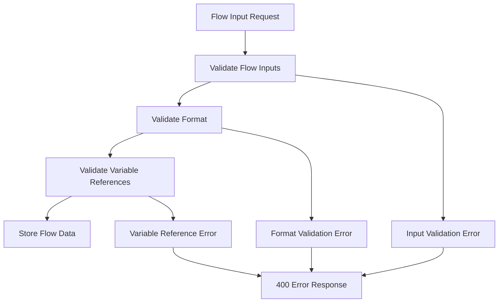

# Flow Validation

## Overview

Sistem flow memiliki **3 layer validation** yang komprehensif:
1. **Flow Inputs Validation** - Validasi definisi input dinamis
2. **Format Validation** - Validasi React Flow dan Steps format
3. **Variable Reference Validation** - Validasi variable references dalam flow

## Validation Process Flow



## 1. Flow Inputs Validation

### Validation Rules

#### Required Fields
- `name`: Harus diisi dan valid variable name
- `type`: Harus salah satu dari tipe yang didukung

#### Name Validation
```php
// Pattern: [a-zA-Z_][a-zA-Z0-9_]*
if (!preg_match('/^[a-zA-Z_][a-zA-Z0-9_]*$/', $input['name'])) {
    return ["Input name must be a valid variable name"];
}
```

**Valid Examples:**
- `username` ✅
- `user_email` ✅
- `apiKey123` ✅
- `firstName` ✅

**Invalid Examples:**
- `user-name` ❌ (contains dash)
- `user name` ❌ (contains space)
- `123name` ❌ (starts with number)
- `user@email` ❌ (contains special char)

#### Type Validation
Supported types: `string`, `email`, `password`, `number`, `boolean`, `object`, `array`, `file`, `date`, `json`

#### Type-Specific Validation

**String Type:**
```json
{
  "name": "username",
  "type": "string",
  "validation": {
    "min_length": 3,
    "max_length": 50,
    "pattern": "^[a-zA-Z0-9_]+$"
  }
}
```

**Number Type:**
```json
{
  "name": "age",
  "type": "number",
  "validation": {
    "min": 0,
    "max": 120,
    "integer": true
  }
}
```

**Email Type:**
```json
{
  "name": "userEmail",
  "type": "email",
  "validation": {
    "allowed_domains": ["example.com", "test.com"]
  }
}
```

**Array Type:**
```json
{
  "name": "tags",
  "type": "array",
  "validation": {
    "min_items": 1,
    "max_items": 10,
    "unique_items": true
  }
}
```

### Error Examples

```json
// Missing required fields
{
  "status": "error",
  "message": "Invalid flow inputs: Input 0: name is required, Input 1: type is required"
}

// Invalid name format
{
  "status": "error",
  "message": "Invalid flow inputs: Input username: name must be a valid variable name"
}

// Invalid type
{
  "status": "error",
  "message": "Invalid flow inputs: Input age: invalid type 'integer', must be one of: string, email, password, number, boolean, object, array, file, date, json"
}

// Validation rule failed
{
  "status": "error",
  "message": "Invalid flow inputs: Input username: minimum length is 3, Input password: pattern does not match"
}
```

## 2. Format Validation

### React Flow Format Validation

#### Required Structure
```json
{
  "nodes": [...], // Array of nodes
  "edges": [...]  // Array of edges
}
```

#### Node Validation
Each node must have:
- `id`: Required, unique, valid variable name
- `type`: Required, supported node type
- `data.name`: Required, non-empty string
- `position`: Required, object with `x` and `y` coordinates

**Valid Node Example:**
```json
{
  "id": "register_user",
  "type": "apiCall",
  "position": {"x": 100, "y": 100},
  "data": {
    "name": "Register User",
    "method": "POST",
    "url": "https://api.example.com/register",
    "headers": {},
    "body": {},
    "outputs": {}
  }
}
```

#### Edge Validation
Each edge must have:
- `id`: Required, unique
- `source`: Required, refers to existing node ID
- `target`: Required, refers to existing node ID

**Valid Edge Example:**
```json
{
  "id": "edge_1",
  "source": "register_user",
  "target": "verify_email",
  "type": "smoothstep"
}
```

### Steps Format Validation

#### Required Structure
```json
{
  "version": "1.0",
  "steps": [...], // Array of steps
  "config": {}   // Configuration object
}
```

#### Step Validation
Each step must have:
- `id`: Required, unique, valid variable name
- `name`: Required, non-empty string
- `method`: Required, valid HTTP method
- `url`: Required, valid URL

**Valid Step Example:**
```json
{
  "id": "register_user",
  "name": "Register User",
  "method": "POST",
  "url": "https://api.example.com/register",
  "headers": {},
  "body": {},
  "outputs": {}
}
```

### Format Error Examples

```json
// Invalid React Flow - missing nodes
{
  "status": "error",
  "message": "Invalid flow format: Missing required field 'nodes'"
}

// Invalid React Flow - invalid node
{
  "status": "error",
  "message": "Invalid flow format: Node missing required field 'id', Node missing required field 'type'"
}

// Invalid Steps - missing steps
{
  "status": "error",
  "message": "Invalid flow format: Missing required field 'steps'"
}

// Invalid Steps - invalid step
{
  "status": "error",
  "message": "Invalid flow format: Step missing required field 'id', Step missing required field 'method'"
}
```

## 3. Variable Reference Validation

### Reference Format
All references must follow pattern: `{{type.field}}`

#### Supported Types
- `input`: Flow inputs
- `env`: Environment variables
- `headers`: Request headers
- `[stepId]`: Step outputs (step ID validation)

#### Validation Rules

**Format Validation:**
```php
// Must contain dot separator
if (!strpos($reference, '.')) {
    return ["Invalid variable reference format '$reference'. Expected format: type.field"];
}
```

**Type Validation:**
```php
$validTypes = ['input', 'env', 'headers'];
if (!in_array($type, $validTypes)) {
    // Check if it's a valid step ID
    if (!preg_match('/^[a-zA-Z_][a-zA-Z0-9_]*$/', $type)) {
        return ["Invalid reference type '$type'"];
    }
}
```

**Field Validation:**
```php
// Field name must be valid variable name
if (!preg_match('/^[a-zA-Z_][a-zA-Z0-9_]*$/', $field)) {
    return ["Invalid field name '$field'"];
}
```

### Reference Examples

#### Valid References
```json
{
  "url": "{{input.username}}",        // Input reference
  "url": "{{env.API_URL}}",           // Environment reference
  "url": "{{headers.Authorization}}",  // Header reference
  "url": "{{login.userId}}",          // Step output reference
  "body": "{{step1.output.field}}"     // Step output with nested field
}
```

#### Invalid References
```json
{
  "url": "{{invalidreference}}",       // No dot separator
  "url": "{{user.invalid-field}}",     // Invalid field name (dash)
  "url": "{{@invalid.type}}",          // Invalid type (special char)
  "url": "{{123invalid.field}}"        // Invalid step ID (starts with number)
}
```

### Extraction Logic

#### From URLs
```php
// Input: "https://api.example.com/users/{{input.userId}}"
// Output: ["input.userId"]

preg_match_all('/\{\{([^}]+)\}\}/', $string, $matches);
// $matches[1] = ["input.userId"]
```

#### From Headers
```php
// Input: {"Authorization": "Bearer {{input.token}}"}
// Output: ["input.token"]

foreach ($headers as $key => $value) {
    if (is_string($value)) {
        $refs = extractVariableReferences($value);
    }
}
```

#### From Body
```php
// Input: {"user": "{{input.username}}", "role": "{{step.role}}"}
// Output: ["input.username", "step.role"]

function extractFromArray($array) {
    $references = [];
    foreach ($array as $key => $value) {
        if (is_string($value)) {
            $refs = extractVariableReferences($value);
            $references = array_merge($references, $refs);
        } elseif (is_array($value)) {
            $refs = extractFromArray($value);
            $references = array_merge($references, $refs);
        }
    }
    return $references;
}
```

### Variable Reference Error Examples

```json
// Invalid format
{
  "status": "error",
  "message": "Invalid variable references: Step 0: Invalid variable reference format 'invalidreference'. Expected format: type.field"
}

// Invalid field name
{
  "status": "error",
  "message": "Invalid variable references: Step 0: Invalid field name 'invalid-field' in reference 'step.invalid-field'"
}

// Invalid type
{
  "status": "error",
  "message": "Invalid variable references: Step 0: Invalid reference type '@invalid'. Must be one of: input, env, headers or a valid step ID"
}
```

## Error Response Format

### Standard Error Structure
```json
{
  "status": "error",
  "message": "Error description",
  "details": {
    "validation_type": "flow_inputs|format|variable_references",
    "errors": [
      {
        "field": "username",
        "rule": "required",
        "message": "Field is required"
      }
    ]
  }
}
```

### HTTP Status Codes
- **400**: Bad Request - Validation errors
- **422**: Unprocessable Entity - Data format issues
- **500**: Internal Server Error - Conversion failures

## Validation in Different Contexts

### Create Flow Validation
```bash
POST /gassapi2/backend/?act=flow_create&id=proj_123
Content-Type: application/json

{
  "name": "Test Flow",
  "flow_inputs": [...],
  "flow_data": {
    "nodes": [...],
    "edges": [...]
  }
}
```

### Update Flow Validation
```bash
PUT /gassapi2/backend/?act=flow_update&id=flow_456
Content-Type: application/json

{
  "flow_data": {
    "nodes": [...],
    "edges": [...]
  }
}
```

### UI Update Validation
```bash
PUT /gassapi2/backend/?act=flow_update_ui&id=flow_456
Content-Type: application/json

{
  "flow_data": {
    "nodes": [...],
    "edges": [...]
  }
}
```

## Best Practices

### 1. **Input Design**
- Use clear, descriptive names
- Provide comprehensive validation rules
- Include helpful descriptions
- Set appropriate defaults

### 2. **Variable References**
- Use specific references (`{{login.userId}}` vs `{{output}}`)
- Validate step dependencies
- Handle missing references gracefully

### 3. **Error Handling**
- Provide clear, actionable error messages
- Include field names and validation rules
- Group related errors together

### 4. **Testing Validation**
```php
// Test invalid inputs
$invalidInputs = [
    ['name' => '', 'type' => 'string'],                    // Missing name
    ['name' => 'user-name', 'type' => 'string'],           // Invalid name
    ['name' => 'email', 'type' => 'invalid_type'],           // Invalid type
];

foreach ($invalidInputs as $input) {
    $errors = FlowValidator::validateFlowInputs([$input]);
    $this->assertNotEmpty($errors);
}

// Test variable references
$invalidReferences = [
    '{{invalidreference}}',                                   // No dot
    '{{step.invalid-field}}',                                  // Invalid field
    '{{@invalid.type}}',                                       // Invalid type
];

foreach ($invalidReferences as $reference) {
    $errors = FlowValidator::validateSingleReference($reference, 0);
    $this->assertNotEmpty($errors);
}
```

## Performance Considerations

### Validation Optimization
1. **Early Validation**: Stop at first error for performance
2. **Caching**: Cache validation results for repeated data
3. **Efficient Regex**: Use optimized patterns
4. **Lazy Loading**: Validate only when needed

### Memory Management
```php
class FlowValidator {
    private static $validationCache = [];

    public static function validateFlowInputs($inputs) {
        $cacheKey = md5(json_encode($inputs));

        if (isset(self::$validationCache[$cacheKey])) {
            return self::$validationCache[$cacheKey];
        }

        $errors = self::performValidation($inputs);
        self::$validationCache[$cacheKey] = $errors;

        return $errors;
    }
}
```

## Integration Examples

### Frontend Validation
```javascript
// Client-side validation before API call
function validateFlowInputs(inputs) {
    const errors = [];

    inputs.forEach((input, index) => {
        if (!input.name) {
            errors.push(`Input ${index}: Name is required`);
        }

        if (!/^[a-zA-Z_][a-zA-Z0-9_]*$/.test(input.name)) {
            errors.push(`Input ${index}: Invalid name format`);
        }

        if (!input.type) {
            errors.push(`Input ${index}: Type is required`);
        }
    });

    return errors;
}

// Usage
const inputs = [
    { name: 'username', type: 'string' },
    { name: 'user-email', type: 'email' } // Will fail validation
];

const errors = validateFlowInputs(inputs);
if (errors.length > 0) {
    console.error('Validation errors:', errors);
}
```

### API Response Handling
```javascript
async function createFlow(flowData) {
    try {
        const response = await fetch('/gassapi2/backend/?act=flow_create', {
            method: 'POST',
            headers: {
                'Content-Type': 'application/json',
                'Authorization': `Bearer ${token}`
            },
            body: JSON.stringify(flowData)
        });

        const result = await response.json();

        if (result.status === 'error') {
            // Handle validation errors
            throw new Error(result.message);
        }

        return result.data;
    } catch (error) {
        console.error('Failed to create flow:', error);
        throw error;
    }
}
```

## Troubleshooting

### Common Validation Issues

#### 1. **Name Format Errors**
**Problem**: `user-name` contains dash
**Solution**: Use `user_name` or `userName`

#### 2. **Variable Reference Format**
**Problem**: `{{output}}` too generic
**Solution**: Use `{{stepName.outputField}}`

#### 3. **Missing Required Fields**
**Problem**: Step missing `method` field
**Solution**: Add required HTTP method

#### 4. **Circular References**
**Problem**: Steps reference each other
**Solution**: Restructure flow to avoid cycles

### Debugging Tips

1. **Enable Debug Mode**: Add debug logging to see validation process
2. **Test Individual Components**: Validate inputs, format, and references separately
3. **Check Error Details**: Look at specific validation rule that failed
4. **Use Valid Examples**: Compare with working examples

```php
// Enable debug logging
error_log("FlowValidator: Validating inputs: " . json_encode($inputs));
error_log("FlowValidator: Validation errors: " . json_encode($errors));
```